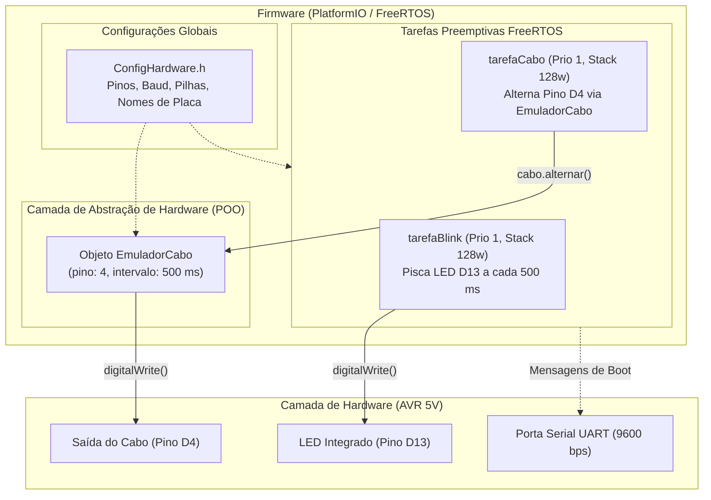

# Contexto e Arquitetura Técnica — Projeto Bancada

Este documento consolida a arquitetura de pastas, os códigos-fonte, as diretrizes de hardware e as convenções de projeto para consulta contínua em sessões de chat e desenvolvimento.

---

## 1. Visão Geral do Projeto

O projeto **Bancada** é uma aplicação embarcada desenvolvida com **PlatformIO** sobre o framework **Arduino** para a família de microcontroladores Atmel AVR (**ATmega328P** e **ATmega2560**). Ele integra o sistema operacional de tempo real **FreeRTOS** (`feilipu/FreeRTOS`), viabilizando multitarefa preemptiva com temporização determinística e gerenciamento concorrente de periféricos.

### Metadados Técnicos

| Parâmetro | Especificação | Observações |
| :--- | :--- | :--- |
| **Workspace** | `c:\Users\italo\...\sistema-embarcado\Bancada` | Subprojeto do repositório acadêmico |
| **Microcontroladores** | Arduino Nano (ATmega328P) / Mega 2560 (ATmega2560) | Ambos operando a 16 MHz / 5V |
| **SRAM Disponível** | Nano: **2048 bytes (2 KB)** \| Mega: **8192 bytes (8 KB)** | Requer dimensionamento rigoroso de pilhas |
| **Flash** | Nano: 32 KB \| Mega: 256 KB | Memória de programa |
| **Baud Rate Serial** | **9600 bps** (8-N-1) | Padrão unificado no firmware e monitor |
| **Sistema Operacional** | FreeRTOS Kernel v11.1.0-3 (`feilipu/FreeRTOS`) | Escalonador preemptivo baseado em prioridades |
| **Paradigmas** | Programação Orientada a Objetos (C++) + RTOS | Abstração em classes (`EmuladorCabo`) |

---

## 2. Diagrama de Arquitetura do Sistema



---

## 3. Estrutura de Pastas e Finalidade dos Arquivos

```text
Bancada/
├── .pio/                  # Diretório gerado pelo PlatformIO (compilados, bibliotecas)
├── .vscode/               # Configurações do VS Code (C/C++ properties, extensões)
├── docs/                  # Documentação técnica e esquemáticos
│   ├── README.md          # Orientações sobre a documentação
│   └── pinout.md          # Mapeamento completo de pinos para Nano e Mega 2560
├── include/               # Arquivos de cabeçalho globais
│   └── ConfigHardware.h   # Definições de hardware, macros de identificação e pilhas
├── lib/                   # Módulos reutilizáveis em C++ (POO)
│   └── EmuladorCabo/      # Biblioteca de controle e simulação do sinal de cabo
│       ├── EmuladorCabo.h # Declaração da classe EmuladorCabo
│       └── EmuladorCabo.cpp # Implementação dos métodos da classe
├── src/                   # Ponto de entrada do firmware
│   └── main.cpp           # Setup, inicialização serial e instanciação das tarefas FreeRTOS
├── tests/                 # Estrutura preparada para automação de testes
│   ├── python/            # Scripts de automação e integração em Python
│   ├── relatorios/        # Relatórios de execução de testes (HTML, Markdown)
│   └── robot/             # Suítes de teste de aceitação (Robot Framework)
├── .gitignore             # Arquivos ignorados pelo controle de versão Git
├── CONTEXTO.md            # [ESTE ARQUIVO] Guia mestre de arquitetura para o chat e equipe
├── GEMINI.md              # Regras de sistema injetadas automaticamente no chat
├── platformio.ini         # Configuração de compilação para os 3 ambientes AVR
└── README.md              # Visão geral do projeto e instruções de uso
```

---

## 4. Análise Aprofundada dos Códigos-Fonte

### 4.1. `platformio.ini`
O arquivo gerencia 3 perfis de compilação baseados no mesmo código-fonte:
1. **`[env:nanoatmega328]`**: Arduino Nano com o bootloader ATmega328P tradicional (padrão em placas clone com chip conversor CH340). Usa a macro `-D PLACA_NANO`.
2. **`[env:nanoatmega328new]`**: Arduino Nano com bootloader atualizado (placas oficiais pós-2018). Usa a macro `-D PLACA_NANO`.
3. **`[env:megaatmega2560]`**: Arduino Mega 2560 (microcontrolador ATmega2560 com 8 KB de SRAM e 256 KB de Flash). Usa a macro `-D PLACA_MEGA`.

Configurações comuns:
- `monitor_speed = 9600`: Alinhado com o firmware.
- `monitor_filters = time, send_on_enter`: Adiciona timestamps e envia dados ao pressionar Enter.
- `lib_deps = feilipu/FreeRTOS @ ^11.1.0-3`: Instalação automática do port do FreeRTOS para microcontroladores AVR.

---

### 4.2. `include/ConfigHardware.h`
Centraliza as definições de hardware, evitando números mágicos espalhados pelo código:
- **Detecção de Placa:**
  Usa `#if defined(PLACA_MEGA) || defined(__AVR_ATmega2560__)` para definir `NOME_PLACA "Arduino Mega 2560 (5V)"` e `#elif defined(PLACA_NANO)` para definir `"Arduino Nano (5V)"`.
- **Pinos Mapeados:**
  - `PINO_LED_STATUS`: Pino digital 13 (LED integrado na placa).
  - `PINO_CABO_BLINK`: Pino digital 4 (D4).
- **Dimensionamento das Pilhas das Tarefas (em words):**
  - `STACK_BLINK`: 128 words.
  - `STACK_CABO`: 128 words.
  > [!NOTE]
  > No FreeRTOS para AVR, o tamanho da stack passado para `xTaskCreate()` é medido em **words (2 bytes)**, não em bytes. Uma stack de 128 words consome **256 bytes** de SRAM por tarefa.

---

### 4.3. `lib/EmuladorCabo/EmuladorCabo.h` e `EmuladorCabo.cpp`
Encapsula o comportamento do pino digital em uma classe C++ orientada a objetos:
- **Atributos Privados:**
  - `_pino`: Número do pino GPIO associado (padrão D4).
  - `_intervalo`: Intervalo de alternância em milissegundos (padrão 500 ms).
  - `_ultimoTempo`: Armazena o registro de `millis()` para operação não-bloqueante autônoma.
  - `_estado`: Booleano indicando nível lógico atual (`HIGH` ou `LOW`).
- **Métodos Públicos:**
  - `begin()`: Executa `pinMode(_pino, OUTPUT)` e escreve o estado inicial LOW.
  - `alternar()`: Inverte o estado lógico com `digitalWrite(_pino, _estado)`.
  - `ligar()` e `desligar()`: Forçam estado específico.
  - `atualizar()`: Implementa lógica não-bloqueante via `millis()` (útil para uso fora de tasks de RTOS).
  - `setIntervalo(ms)`: Reconfigura dinamicamente a frequência do piscar.
  - `getEstado()` e `getPino()`: Métodos seletores de leitura (*getters* const).

---

### 4.4. `src/main.cpp`
Orquestrador do sistema com FreeRTOS:
1. **Instanciação Global:**
   `EmuladorCabo cabo(PINO_CABO_BLINK, 500);`
2. **`tarefaBlink` (Prioridade 1):**
   - Configura o pino 13 como saída e entra em loop infinito.
   - Alterna o LED e executa `vTaskDelay(pdMS_TO_TICKS(500))`.
3. **`tarefaCabo` (Prioridade 1):**
   - Inicializa a interface física com `cabo.begin()`.
   - Alterna o sinal chamando `cabo.alternar()` e bloqueia por 500 ms com `vTaskDelay`.
4. **`setup()`:**
   - Inicia `Serial.begin(9600)`.
   - Exibe o cabeçalho formatado na UART com o nome da placa detectada e parâmetros ativos.
   - Instancia as duas tarefas via `xTaskCreate()`.
5. **`loop()`:**
   - Mantido vazio. No Arduino AVR com `feilipu/FreeRTOS`, após o término do `setup()`, o escalonador preemptivo assume o controle exclusivo do microcontrolador.

---

## 5. Mapeamento de Pinos (Pinout)

| Sinal | Função | Pino Arduino Nano | Pino Arduino Mega 2560 | Comportamento no Firmware |
| :--- | :--- | :---: | :---: | :--- |
| **LED Status** | Indicador Heartbeat | **D13** | **D13** | Pisca a cada 500 ms via `tarefaBlink` |
| **Cabo Blink** | Saída Emulador Cabo | **D4** | **D4** | Alterna a cada 500 ms via `tarefaCabo` |
| **UART RX** | Recepção Serial | **D0 (RX)** | **D0 (RX0)** | 9600 bps |
| **UART TX** | Transmissão Serial | **D1 (TX)** | **D1 (TX0)** | 9600 bps |
| **VCC** | Alimentação Lógica | **5V** | **5V** | Nível lógico 5V TTL |
| **GND** | Referência Elétrica | **GND** | **GND** | 0V comum |

---

## 6. Cuidados Críticos com Memória SRAM (AVR)

> [!WARNING]
> O microcontrolador **ATmega328P** (Arduino Nano) possui apenas **2048 bytes (2 KB) de SRAM**.  
> O FreeRTOS aloca as seguintes estruturas diretamente na SRAM:
> - **Heap do FreeRTOS** (gerenciador de memória de tarefas).
> - **Task Control Block (TCB)** para cada tarefa criada (~80 bytes por tarefa).
> - **Stack de cada tarefa** (ex: 128 words = 256 bytes por tarefa).

Com 2 tarefas de 128 words + TCBs + variáveis globais e buffers de UART, o consumo de RAM se aproxima de **800 a 1000 bytes** (~45% a 50% da SRAM do Nano).

### Diretrizes de Segurança de Memória:
1. **Não exceder 128 words** de stack sem justificativa em tarefas no ATmega328P.
2. **Evitar criar buffers locais gigantes** dentro do corpo das tarefas; prefira variáveis globais ou buffers declarados como `static`.
3. **Evitar uso de `String` dinâmica** em tarefas frequentes, pois causam fragmentação de memória (Heap). Sempre que possível, utilize `char[]` de tamanho fixo ou a macro `F()` para strings literais em flash (ex: `Serial.println(F("Texto"));`).

---

## 7. Relação com o Projeto Avançado (`bancada_de_teste`)

No mesmo repositório existe o projeto `bancada_de_teste`, que representa uma evolução funcional completa da bancada para teste de **Estações de Recarga de Veículos Elétricos (IEC 61851-1 Modo 3 e IEC 62196-2 Tipo 2)**.

### Paralelo entre os dois projetos:
- **`Bancada/` (Projeto Atual):** Base enxuta, comutação do pino D4 com POO, focada em Arduino Nano e Mega a 9600 baud, ideal para verificação de tarefas FreeRTOS e controle digital básico.
- **`bancada_de_teste/` (Projeto Completo):**
  - Emula o pino **PP (Proximity Pilot)** com 6 resistores chaveados por MOSFETs (S1 a S6: 4700R, 1500R/13A, 680R/20A, 220R/32A, 100R/63A e 47R/Falha).
  - Possui lógica de intertravamento *break-before-make* para evitar resistências em paralelo.
  - Implementa um terminal CLI interativo via Serial (115200 baud).
  - Contém suíte de homologação automatizada com **Robot Framework** (`tests/robot/teste_emulador.robot`) e relatórios visuais.

---

## 8. Guia Rápido de Comandos PlatformIO

Executar no terminal dentro da pasta `Bancada`:

```bash
# Compilar projeto para Arduino Nano (Bootloader Antigo / CH340)
pio run -e nanoatmega328

# Compilar projeto para Arduino Nano (Bootloader Novo)
pio run -e nanoatmega328new

# Compilar projeto para Arduino Mega 2560
pio run -e megaatmega2560

# Gravação (Upload) na placa conectada
pio run -e nanoatmega328 --target upload

# Abrir o monitor serial interativo a 9600 bps
pio device monitor -b 9600

# Limpar arquivos de compilação
pio run --target clean
```

