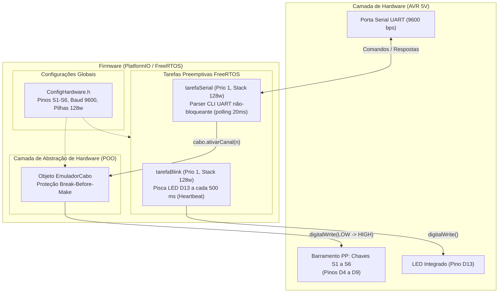

# Contexto e Arquitetura Técnica — Projeto Bancada

Este documento consolida a arquitetura de pastas, códigos-fonte, periféricos de hardware e regras do projeto para consulta permanente em qualquer sessão de chat ou desenvolvimento.

---

## 🤝 Metodologia de Interação Obrigatória (Regra Permanente)
- **Modo Passo a Passo com Autorização Prévia:** O assistente **NUNCA** deve aplicar alterações ou criar/modificar arquivos sem antes:
  1. Apresentar uma explicação técnica detalhada da lógica (software e eletrônica).
  2. Exibir o código exato que está sendo proposto.
  3. Solicitar expressamente a permissão/autorização do usuário.
  4. **Aguardar a confirmação explícita do usuário** antes de invocar qualquer ferramenta de modificação.

---

## 1. Visão Geral do Projeto

O projeto **Bancada** é uma aplicação embarcada desenvolvida com **PlatformIO** sobre o framework **Arduino** para a família de microcontroladores Atmel AVR (**ATmega328P** e **ATmega2560**). Ele integra o sistema operacional de tempo real **FreeRTOS** (`feilipu/FreeRTOS`), viabilizando multitarefa preemptiva com temporização determinística e gerenciamento concorrente de periféricos.

### Metadados Técnicos

| Parâmetro | Especificação | Observações |
| :--- | :--- | :--- |
| **Workspace** | `c:\Users\italo\...\sistema-embarcado\Bancada` | Subprojeto do repositório acadêmico |
| **Microcontroladores** | Arduino Nano (ATmega328P) / Mega 2560 (ATmega2560) | Ambos operando a 16 MHz / 5V TTL |
| **SRAM Disponível** | Nano: **2048 bytes (2 KB)** \| Mega: **8192 bytes (8 KB)** | Requer dimensionamento rigoroso de pilhas |
| **Flash** | Nano: 32 KB \| Mega: 256 KB | Memória de programa |
| **Baud Rate Serial** | **9600 bps** (8-N-1) | Padrão unificado no firmware e monitor |
| **Sistema Operacional** | FreeRTOS Kernel v11.1.0-3 (`feilipu/FreeRTOS`) | Escalonador preemptivo baseado em prioridades |
| **Norma de Referência** | IEC 62196-2 / IEC 61851-1 (Pino PP) | Barramento de resistores de 47R a 4700R |

---

## 2. Diagrama de Arquitetura do Sistema



---

## 3. Protocolo Serial da Bancada (CLI UART em 9600 baud)

A interface CLI opera de forma não-bloqueante na `tarefaSerial`, respondendo com mensagens estritas:

| Comando Recebido | Ação Executada | Resposta Serial |
| :--- | :--- | :---: |
| **`cabo 0`** | Desliga todas as chaves (Circuito Aberto) | `OK` |
| **`cabo 1`** | Ativa S1 ($4700\,\Omega$ - Desconectado nominal) | `OK` |
| **`cabo 2`** | Ativa S2 ($1500\,\Omega$ - Cabo 13 A) | `OK` |
| **`cabo 3`** | Ativa S3 ($680\,\Omega$ - Cabo 20 A) | `OK` |
| **`cabo 4`** | Ativa S4 ($220\,\Omega$ - Cabo 32 A) | `OK` |
| **`cabo 5`** | Ativa S5 ($100\,\Omega$ - Cabo 63 A) | `OK` |
| **`cabo 6`** | Ativa S6 ($47\,\Omega$ - Simulação de Falha/Curto) | `OK` |
| **`cabo <invalido>`** | Argumento fora de 0 a 6 ou não numérico | `ERRO: Cabo` |
| **`help` ou `?`** | Imprime o menu com os comandos e a tabela | Menu de Ajuda |
| **Qualquer outro texto** | Comando não reconhecido | `ERRO` |

---

## 4. Tabela de Pinos do Emulador de Cabo (IEC 62196-2 / Pino PP)

| Chave | Resistor ($R_{PP}$) | Capacidade de Corrente | Pino Arduino (Nano / Mega) | Função / Diagnóstico |
| :---: | :---: | :---: | :---: | :--- |
| **0** | Aberto ($\infty$) | 0 A | Todos em LOW | **PADRÃO:** Todas as chaves desligadas |
| **S1** | $4700\,\Omega$ | 0 A | **D4** | Desconectado nominal (cabo solto) |
| **S2** | $1500\,\Omega$ | **13 A** | **D5** | Cabo monofásico 13 A |
| **S3** | $680\,\Omega$ | **20 A** | **D6** | Cabo 20 A |
| **S4** | $220\,\Omega$ | **32 A** | **D7** | Cabo 32 A (comercial mais comum) |
| **S5** | $100\,\Omega$ | **63 A** | **D8** | Cabo trifásico de alta potência |
| **S6** | $47\,\Omega$ | 0 A (Falha) | **D9** | Simulação de curto ou fuga de isolação |
| **STATUS**| — | — | **D13** | LED Onboard (*Heartbeat* a cada 500 ms) |

> [!IMPORTANT]
> **Intertravamento *Break-Before-Make*:**  
> A classe `EmuladorCabo` desliga fisicamente todas as 6 chaves (`digitalWrite LOW`) **antes** de ligar o canal solicitado (`digitalWrite HIGH`), impedindo que dois resistores fiquem em paralelo no pino PP.

---

## 5. Estrutura de Pastas

```text
Bancada/
├── .pio/                  # Diretório gerado pelo PlatformIO (compilados, bibliotecas)
├── .vscode/               # Configurações do VS Code (extensões, intellisense)
├── docs/                  # Documentação técnica e esquemáticos
│   ├── README.md          # Orientações sobre a documentação
│   └── pinout.md          # Mapeamento detalhado de pinos
├── include/               # Arquivos de cabeçalho globais
│   └── ConfigHardware.h   # Mapeamento de pinos S1-S6, baud 9600 e pilhas
├── lib/                   # Módulos reutilizáveis em C++ (POO)
│   └── EmuladorCabo/      # Biblioteca de emulação do cabo PP
│       ├── EmuladorCabo.h # Declaração da classe e enum TipoCabo
│       └── EmuladorCabo.cpp # Implementação dos métodos e Break-Before-Make
├── src/                   # Ponto de entrada do firmware
│   └── main.cpp           # CLI serial interativa e tarefas preemptivas FreeRTOS
├── tests/                 # Estrutura preparada para automação de testes
│   ├── python/            # Scripts de automação e integração em Python
│   ├── relatorios/        # Relatórios de execução de testes (HTML, Markdown)
│   └── robot/             # Suítes de teste de aceitação (Robot Framework)
├── CONTEXTO.md            # [ESTE ARQUIVO] Guia mestre de arquitetura
├── GEMINI.md              # Regras de sistema e metodologia permanente de interação
├── platformio.ini         # Ambientes: nanoatmega328, nanoatmega328new, megaatmega2560
└── README.md              # Visão geral do projeto e instruções de uso
```

---

## 6. Cuidados Críticos com Memória SRAM (AVR)

> [!WARNING]
> O microcontrolador **ATmega328P** (Arduino Nano) possui apenas **2048 bytes (2 KB) de SRAM**.  
> O FreeRTOS aloca as seguintes estruturas diretamente na SRAM:
> - **Heap do FreeRTOS**
> - **Task Control Block (TCB)** para cada tarefa (~80 bytes)
> - **Stack de cada tarefa** (128 words = 256 bytes por tarefa)

### Diretrizes de Segurança:
1. Manter pilhas em **128 words** (`STACK_BLINK 128`, `STACK_CABO 128`).
2. Evitar variáveis locais volumosas dentro das tarefas.
3. Utilizar sempre a macro `F()` para strings literais enviadas à Serial (ex: `Serial.println(F("OK"));`), economizando memória RAM e armazenando os textos na memória Flash.

---

## 7. Guia Rápido de Comandos PlatformIO

```bash
# Compilar projeto para Arduino Nano (Bootloader Antigo / CH340)
pio run -e nanoatmega328

# Compilar projeto para Arduino Nano (Bootloader Novo)
pio run -e nanoatmega328new

# Compilar projeto para Arduino Mega 2560
pio run -e megaatmega2560

# Gravação (Upload) na placa conectada
pio run -e nanoatmega328 --target upload

# Abrir o monitor serial interativo a 9600 bps
pio device monitor -b 9600
```
